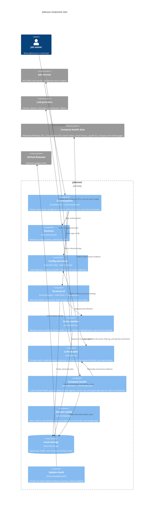

# Architecture and Design

This page is the blueprint for `jobscout`: what the major pieces are, how data
moves through the app, which job sources it can use, and how Company Health is
scored.

For task-specific details, see:

- [LLM Features](LLM_FEATURES.md)
- [Benchmark Reports](BENCHMARKS.md)
- [Demo Mode](DEMO_MODE.md)
- [Release](RELEASE.md)

## Design Goals

- Keep job data local by default.
- Work without an LLM provider.
- Treat LLM features as optional helpers, not the core source of truth.
- Support multiple job-source types because no single job board is complete.
- Prefer deterministic parsing and validation before asking an LLM.
- Let users add sources through `config.yaml` without changing code.
- Fail softly when a source blocks requests, changes markup, or times out.

## Component View



## How A Fetch Works

1. `jobscout` loads `config.yaml`, `SEARCH_PROMPT.md`, criteria, and the local
   SQLite database path.
2. The fetch pipeline resolves effective sources from config, selected role
   families, and work settings.
3. Enabled source groups run with bounded concurrency.
4. Fetched jobs are normalized into the same `Job` shape.
5. Deterministic filters remove jobs that clearly do not match.
6. Company identity enrichment fills company website, summary, and industry
   when possible.
7. Optional LLM filtering reviews only jobs that still need fit judgment.
8. Validation rejects non-job URLs, weak results, duplicates, and already-saved
   jobs.
9. Accepted jobs are shown in the fetch review flow before they are saved.

## Job Sources

There are multiple source types because different job boards expose different
surfaces. Some sources are always user-configurable, and some built-in catalog
sources are selected only when they match the user's role families and work
settings.

| Source type | What it does | Default behavior |
| --- | --- | --- |
| `rss` | Reads RSS feeds from the built-in catalog and user config. | Enabled. Built-in RSS feeds are resolved from selected role families. |
| `site` | Uses direct site-search targets and browser-backed page inspection. | Enabled. Users can add targets in `config.yaml`. |
| `llm` | Sends `SEARCH_PROMPT.md` to the configured model and asks for jobs as JSON. | Optional. Requires an LLM provider. |
| `api` | Reads configured structured API sources. Currently only `type: remotive` is implemented. | Disabled during normal runs unless explicitly selected. |
| `llm_web` | Builds targeted `site:` web-search queries for provider-backed web search. | Experimental and disabled by default. |

### Conditional Source Selection

The built-in catalog is not a flat list that always runs.

- Role families choose role-specific RSS feeds and specialty sources.
- `kube.careers` is used only when DevOps / SRE / Systems is selected.
- If the user selects only remote work, only the Built In remote catalog target
  is used from the Built In catalog.
- If the user selects hybrid or on-site work, `jobscout` picks the closest Built
  In regional site from the candidate location. If no region matches, it falls
  back to the general Built In tech jobs target.
- If remote is selected along with hybrid or on-site work, the Built In remote
  target can run alongside the closest regional target.
- User-configured site targets still run when site search is enabled.

### Built-In RSS Catalog

- Remotive: Software Development, DevOps, AI/ML, Data, Design, Product, Other
  Specialized
- We Work Remotely: Frontend, Backend, Full-Stack, DevOps, Programming, Design,
  Product, Other Specialized
- Real Work From Anywhere: Frontend, Backend, Full-Stack, DevOps, AI, Data,
  Design, Product, Other Specialized

### Built-In Site Search Catalog

- Indeed Jobs
- LinkedIn Jobs
- Y Combinator Jobs
- Himalayas Remote Jobs
- Kube Careers
- Built In Remote Tech Jobs
- Built In Tech Jobs
- Built In Austin
- Built In Boston
- Built In Charlotte
- Built In Chicago
- Built In Colorado
- Built In Los Angeles
- Built In NYC
- Built In Seattle
- Built In San Francisco
- Built In Singapore
- Built In Melbourne
- Built In Sydney

### Default Configurable Site Targets

- Indeed
- LinkedIn
- Y Combinator
- Himalayas
- Built In Remote

### Default Experimental `llm_web` Targets

- Greenhouse
- Lever
- Workday
- Ashby
- SmartRecruiters
- iCIMS
- BambooHR

These targets are represented as `site:` search queries such as:

```text
site:jobs.lever.co principal devops engineer
```

This can find jobs, but search engines and job boards often block bots and LLM
retrieval. That is why `llm_web` is explicit opt-in instead of part of normal
refreshes.

## Company Health

Company Health is an advisory score, not a guarantee. It starts from a neutral
score of `50`, adds stabilizing signals, subtracts risk signals, then clamps the
result to `0-100`.

The deterministic score is calculated before any optional LLM summary. When LLM
Company Health is enabled, the LLM summarizes the evidence into positives,
concerns, and follow-up questions; it does not replace the deterministic score.

### Evidence Sources

Company Health can use:

- company identity already found during job enrichment
- Wikipedia summary and Wikidata facts
- RDAP/domain age when a domain is known
- SEC EDGAR company and filing data
- browser-discovered company profile data
- Hacker News discussion signals
- Google News RSS headlines
- layoff signals, including Layoffs.fyi when available
- stock history when a ticker is known
- optional browser-discovered employer review signals when LLM Company Health is
  enabled

### Score Signals

Positive examples:

- older company age from Wikipedia, Wikidata, or RDAP
- recent SEC filings
- exchange listing signal
- private company with a known age over five years
- company-site profile evidence that fills age or employee-count gaps
- recent news with no negative keywords
- positive news or Hacker News signals

Negative examples:

- risky SEC filing terms
- negative news keywords
- negative Hacker News discussion signals
- layoffs
- stock-price distress

Layoffs do not directly double-penalize the health score. They feed into a
separate employment-risk score, which can then reduce and cap the overall
health score.

### Employment Risk

Employment risk is also scored `0-100` and labeled:

- `Low`: under 25
- `Medium`: 25-49
- `High`: 50-74
- `Critical`: 75+

Risk is calculated from layoff scale and recency, stock decline, SEC risk terms,
and negative news outweighing positive news. High and critical employment risk
can prevent an otherwise positive company from being shown as healthy.

### Score Bands

- `75-100`: relatively healthy
- `55-74`: mixed or uncertain
- `0-54`: caution

Confidence is tracked separately from score. A company can have a reasonable
score with low confidence if only weak public signals were available.

## Package Guide

<details>
<summary>Code package map</summary>

| Package | Responsibility |
| --- | --- |
| `cmd/jobscout` | Binary entrypoint. |
| `internal/jobscout` | Top-level command dispatch and TUI startup. |
| `internal/runtime` | CLI argument parsing and runtime file paths. |
| `internal/config` | App config defaults, loading, normalization, source selection, and demo config. |
| `internal/setup` | Shared setup option definitions. |
| `internal/tuiapp` | Bubble Tea application state, setup flow, fetch flow, and screens. |
| `internal/tui` | Lower-level TUI helpers. |
| `internal/cliui` | ANSI formatting for CLI output. |
| `internal/fetcher` | Source catalogs, source resolution, RSS/API/site fetching, browser search, validation, dedupe, and job identity enrichment. |
| `internal/llm` | Provider auth, model discovery, LLM tasks, web search, benchmarks, reports, and pricing estimates. |
| `internal/health` | Company Health cache loading, browser throttling, and optional LLM assessment orchestration. |
| `internal/domain` | Core data types, role families, criteria, job merge logic, and Company Health scoring. |
| `internal/storage` | SQLite-backed job, health, and company identity stores. |
| `internal/updatecheck` | GitHub release update check. |

</details>
